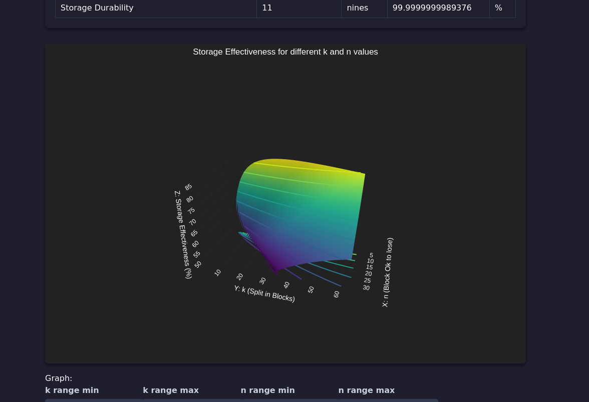

# OuroborosDB Overhead Calculator

This project is a web-based calculator to estimate storage space requirements and durability for data storage systems that use erasure coding. Designed specifically for [OuroborosDB](https://github.com/i5heu/ouroboros-db), it allows to calculate the estimated storage overhead and effectiveness based on different configurations of data chunks and parity blocks.


## Live Demo

Check out the live version of the application [here](https://i5heu.github.io/ouroboros-db-overhead-calculator/).

[](https://i5heu.github.io/ouroboros-db-overhead-calculator/)

## Getting Started

### Prerequisites

Ensure you have Node.js installed on your system. You can install Node.js from [here](https://nodejs.org/).

### Installation

1. Clone the repository:
   ```bash
   git clone https://github.com/i5heu/ouroboros-db-overhead-calculator.git
   ```

2. Navigate to the project directory:
   ```bash
   cd ouroboros-db-overhead-calculator
   ```

3. Install the dependencies:
   ```bash
   npm install
   ```

### Running the Application

To run the development server, use the following command:

```bash
npm run dev
```
This will start the application in development mode. The app will be available at the prompted URL.


To build the application for production:
```bash
npm run build
```

Then, you can serve the build using:

```bash
npm run start
```

This will serve the static files from the `public` folder.

## License
ouroboros-db-overhead-calculator (c) 2024 [Mia Heidenstedt](https://heidenstedt.org/) and contributors

SPDX-License-Identifier: AGPL-3.0